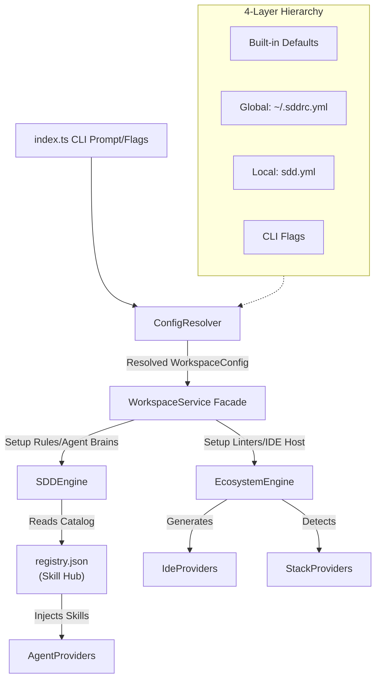

First of all, thank you for taking the time to dedicate your engineering skills (or agentic capabilities) to contribute to `@digitalelvis/sdd-workspace`! 🎉

> **Note**: This document provides all the necessary information to get your local development environment set up, understand our Engine architecture via diagrams, and safely submit your Pull Requests under our governance structure.

## 🛠 Prerequisites

- **Node.js** ≥ 18
- **npm** (comes with Node.js)
- Global familiarity with [Spec-Driven Development (SDD)](https://github.com/tech-leads-club/agent-skills).

## 🚀 Setup

```bash
git clone https://github.com/digitalelvis/sdd-workspace.git
cd ai-sdd-workspace
npm install
npm run build
# The binary can be tested locally using: npm run sdd -- init
```

## 💻 Development Commands

| Command                 | Description                                    |
| ----------------------- | ---------------------------------------------- |
| `npm run dev -- init`   | Run CLI locally bypassing build                |
| `npm run build`         | Compile TypeScript into `/dist`                |
| `npm run test`          | Run all Jest Unit Tests                        |
| `npm run lint`          | Lint codebase via ESLint                       |
| `npm run format`        | Auto-format source files with Prettier         |
| `npm run release`       | Trigger automated SemVer changelog via release-it |

## 📐 Architecture & Domain Model

The `sdd` CLI utilizes a **4-layer hierarchical configuration system** before dispatching to specialized Engines. We separate the concept of "How an IDE looks" from "How an AI Agent behaves" using the **Strategy Pattern**.

### Core Processing Flow



### Key Decisions (ADRs)
We document major architectural changes using **Architecture Decision Records**. Refer to the `docs/adr/` directory for historical context:
- [ADR-001: Workspace Configuration Architecture](./docs/adr/001-config-architecture.md)

## 📁 Project Structure

```text
ai-sdd-workspace/
├── .husky/                       # Git hooks (commit-msg, pre-commit)
├── .github/workflows/            # CI pipeline (ci.yml)
├── src/
│   ├── analyzer/                 # Framework and Ecosystem Detectors
│   ├── cli/                      # Modular CLI layer (Commands & Actions)
│   │   ├── commands/             # Individual command factories
│   │   └── cli-handler.ts        # Global Commander orchestration
│   ├── config/                   # Hierarchical Config & Global Management
│   │   ├── GlobalConfigManager.ts # Business logic for ~/.sddrc.yml
│   │   └── ConfigResolver.ts     # 4-layer merge engine
│   ├── domain/                   # Enums and Interfaces
│   ├── scaffolder/               # Core execution layers
│   ├── resources/                # Static assets bundled with the CLI
│   └── index.ts                  # Minimal Entrypoint
├── docs/
│   └── adr/                      # Architecture Decision Records
├── tests/                        # Jest test definitions mirroring src/
├── commitlint.config.js          # Commit message rules
└── package.json
```

## ⭐ Extending the Ecosystem

### Adding new Stacks/IDEs
1. **Declare the Domain**: Add your literal string to the corresponding Enums (`IdeEnvironment.ts`, `SupportedStack.ts` or `AiAgent.ts`).
2. **Create the Provider Strategy**: Implement the interface (e.g. `WebStormIdeProvider implements IdeProvider`).
3. **Register in Factory**: Add the map to the respective engine (`EcosystemEngine.ts` or `SDDEngine.ts`).

### Adding a new Skill to the Hub
Add an entry to `src/resources/registry.json`:
```json
"my-skill": {
  "resource": "skill",
  "mode": "cli",
  "command": "npx -y publisher/skills install -s my-skill",
  "roles": ["backend"]
}
```

## 🔒 Git Hooks

`npm install` automatically installs two Husky hooks:

| Hook | Trigger | What it does |
| --- | --- | --- |
| `pre-commit` | Every `git commit` | Runs `lint-staged` — ESLint + Prettier on staged `src/` files |
| `commit-msg` | Every `git commit` | Runs `commitlint` — blocks commits that violate the message format |

## 🔄 Release & Governance Process

We use **Release Branching** (`vX.Y.x`) and **Conventional Commits** enforced by `commitlint`.
Never develop directly on `main`.

| Commit Type  | Version Bump  | Example                                        |
| ------------ | ------------- | ---------------------------------------------- |
| `feat:`      | Minor (0.X.0) | `feat(cli): add unified find command`          |
| `fix:`       | Patch (0.0.X) | `fix(sdd): rename AGENT.md to AGENTS.md`       |
| `refactor:`  | No bump       | `refactor(config): extract YamlParser utility` |
| `docs:`      | No bump       | `docs(readme): update setup instructions`      |
| `chore:`     | No bump       | `chore(tooling): initialize husky hooks`       |
| `test:`      | No bump       | `test(engine): add SDDEngine injection tests`  |
| `perf:`      | Patch/Minor   | `perf(registry): lazy-load catalog on demand`  |

> **Note**: Do NOT manually edit `CHANGELOG.md`. It is automated via `release-it`.

## 🚦 CI Pipeline

Every push and Pull Request runs three jobs defined in `.github/workflows/ci.yml`:

| Job | Runs on | What it validates |
| --- | --- | --- |
| `quality` | Push & PR | `lint → test → build` — blocks merge on any failure |
| `commit-lint` | PR only | All commit messages in the PR branch must pass `commitlint` |
| `branch-governance` | PR only | Branch name must follow `<type>/<description>` pattern |

## 🤝 Submitting Contributions
1. **Branch** off the current active release line (e.g. `v0.1.x`) using the `feat/` or `fix/` prefix.
2. **Commit** atomically with Conventional Commits — the `commit-msg` hook will enforce the format.
3. **Push** and **open a Pull Request** targeting the release branch.  Ensure `npm run test` and `npm run build` pass locally before submitting.
