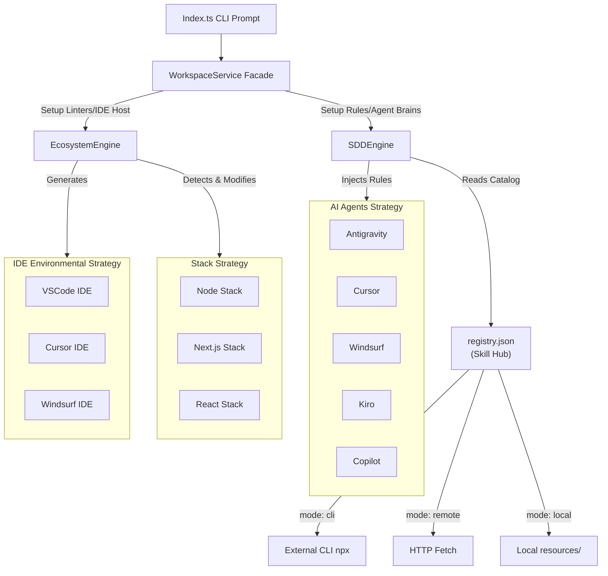

First of all, thank you for taking the time to dedicate your engineering skills (or agentic capabilities) to contribute to `ai-sdd-workspace`! 🎉

> **Note**: This document provides all the necessary information to get your local development environment set up, understand our Engine architecture via diagrams, and safely submit your Pull Requests under our governance structure.

## 🛠 Prerequisites

- **Node.js** ≥ 18
- **npm** (comes with Node.js)
- Global familiarity with [Spec-Driven Development (SDD)](https://github.com/tech-leads-club/agent-skills).

## 🚀 Setup

```bash
git clone https://github.com/your-org/boilerplace.git ai-sdd-workspace
cd ai-sdd-workspace
npm install
npm run build
```

## 💻 Development Commands

| Command                 | Description                        |
| ----------------------- | ---------------------------------- |
| `npm run dev -- init`   | Run CLI locally bypassing build    |
| `npm run build`         | Compile TypeScript into `/dist`    |
| `npm run start -- init` | Execute the compiled JS            |
| `npm run test`          | Run all Jest Unit Tests            |
| `npm run test:watch`    | Run Jest Tests in watch mode       |
| `npm run lint`          | Lint codebase via ESLint           |
| `npm run release`       | Trigger automated SemVer changelog |

## 📐 Architecture & Domain Model

The `ai-sdd-workspace` operates using a highly decoupled **Facade** and **Strategy Pattern** architecture. We separate the concept of "How an IDE looks" from "How an AI Agent behaves", while observing whatever "Stack" the project is running on.

### Core Processing Flow



## 📁 Project Structure

```text
ai-sdd-workspace/
├── src/
│   ├── analyzer/                 # Framework and Ecosystem Detectors
│   ├── domain/                   # Enums and Interfaces (IdeEnvironment, SupportedStack)
│   │   ├── contracts/            # SkillRegistry, IdeProvider, StackProvider...
│   │   └── enums/                # AiAgent, IdeEnvironment, SupportedStack
│   ├── scaffolder/               # Core execution layers
│   │   ├── engines/              # Orchestrators (SDDEngine, EcosystemEngine)
│   │   └── providers/            # Strategy Mappers (Agents, IDEs, Stacks)
│   ├── resources/                # Static assets bundled with the CLI
│   │   ├── registry.json         # Hybrid Skill Hub catalog (cli/remote/local)
│   │   ├── common-rules.md       # Base SDD rules injected into every agent
│   │   ├── *-rules.md            # Stack-specific rule templates
│   │   └── skills/               # Local skill fallback assets
│   └── index.ts                  # CLI Entrypoint (Commander & Inquirer)
├── tests/                        # Jest test definitions
├── .agents/                      # SDD native instructions and offline rules
├── CHANGELOG.md                  # Auto-generated SemVer history
└── package.json
```

## ⭐ Extending the Ecosystem (Adding new Stacks/IDEs)

If you wish to add support for a new Framework (e.g. `Laravel`) or a new IDE (e.g. `WebStorm`):

1. **Declare the Domain**: Add your literal string to the corresponding Enums (`IdeEnvironment.ts`, `SupportedStack.ts` or `AiAgent.ts`).
2. **Create the Provider Strategy**: Implement the interface (e.g. `WebStormIdeProvider implements IdeProvider`).
3. **Register in Factory**: Add the map to the respective engine (`EcosystemEngine.ts` or `SDDEngine.ts`).

### ➕ Adding a new Skill to the Hub

To register a new skill in the catalog, add an entry to `src/resources/registry.json`:

```json
"my-new-skill": {
  "resource": "skill",
  "mode": "cli",
  "command": "npx -y some-publisher/agent-skills install -s my-new-skill",
  "roles": ["backend"]
}
```

Available `mode` values:

- **`cli`** — delegates installation to an external `npx` command (preferred for community packages).
- **`remote`** — downloads a raw Markdown file via HTTP (requires `url` + `path` fields).
- **`local`** — copies from `src/resources/skills/` (fallback for bundled assets).

## 🔄 Release & Governance Process

This project uses **Release Branching** (`vX.Y.x`) and utilizes **Conventional Commits** combined with `release-it` for automated versioning.
Never develop directly on `main`.

| Commit Prefix | Version Bump  | Example                               |
| ------------- | ------------- | ------------------------------------- |
| `feat:`       | Minor (0.X.0) | `feat: add WebStorm ide support`      |
| `fix:`        | Patch (0.0.X) | `fix: correct linter path generation` |
| `refactor:`   | Patch (0.0.X) | `refactor: move constants to domain`  |
| `docs:`       | No bump       | `docs: update README`                 |
| `chore:`      | No bump       | `chore: update deps`                  |

> **Critical Note on Changelog**: Do NOT manually edit `CHANGELOG.md` in your PRs. Our Github action/Release CLI pipeline handles this based on your commit formats. Ensure your commit messages strictly follow the table above.

## 🤝 Submitting Contributions

1. **Fork** the repository
2. **Branch** off the current active release line (e.g. `git checkout -b feat/add-new-stack`)
3. **Commit** with conventional commits (`git commit -m "feat: add Go stack provider"`)
4. **Push** to your fork (`git push origin feat/add-new-stack`)
5. **Open** a Pull Request targeting the active release branch. Ensure all Jest tests are passing (`npm run test`) prior to submission.
